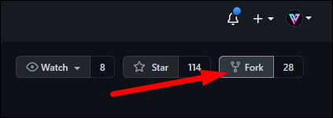
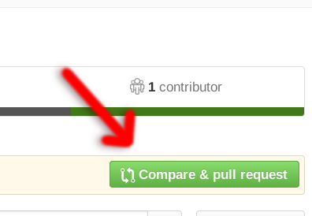

<h1 align="center">Hacktober-Fest-2022 💻👩‍💻🚀</h1>

- Follow on Linkedin: 

- Follow on Medium: 

### `Hacktoberfest: a month-long celebration of open-source projects, their maintainers, and the entire community of contributors.`

Do drop a follow if you like my work 😀 

This is a repository to participate in hacktober fest 2022 and learn about using github as an open source tool.

## On participating in hacktober fest and being in the first `40000` contributors to open pull requests, you get:
- Either a tree planted in your name
- Or a hacktober fest T-Shirt

## What to contribute? 🤔

Add a `data structure` or an `algorithm` with proper language category.
For example: I have added a linked list and its related operations in C++ folder.

## How to contribute? 🤝

- `Fork` this repo.
- `Write into a file` of proper category:   
- `Push the changes`with commit messages on whatever you added.
- `Compare And Pull Request` with proper description and title.
-  Wait for me to `review` and `merge` your contribution.

## How to make a pull request? (for first timers - beginners)

Contributing for the first time? I got you 😀

- `Fork` the repo. (a copy of this repo will be made on your account).

- Write what you want in the proper file.  
    Two ways to write:  
  - Clone the repo or download the zip folder and write into it. (download the code)
  - Press dot on the main page of the forked repository on your account, `VS Code Web` will open and then write into it.  
- Once you are done writing, add the necessary files with `➕ button` in github or use `git add --all`.  
- Then commit the files using the `✔ button` in vs code or use command `git commit -m "message"` command where in `message`, you will write a message about whatever you added.  

- Go to the main page of your forked repo on your account. You will see a `Compare And Pull Request` button. Click that. 

- Go to `Pull requests` tab if you dont see the button mentioned.

- You will be redirected to the pull requests tab of this repo. Add a title for your pull request and a little description.

## Things to note ✏:

- Make sure you dont change some one else's added commits.
- Be respectful and make sure you dont add any offensive content.
- Do write a brief `description` and proper `title` for your pull request.

## Having trouble? Ask in discussions:

<a href = "https://github.com/Umar-Waseem/Contribute-Hacktober-Fest-2022/discussions" >Discussions</a>

## Get yourself featured here as an Open Source Contributor 🎉🙌:

